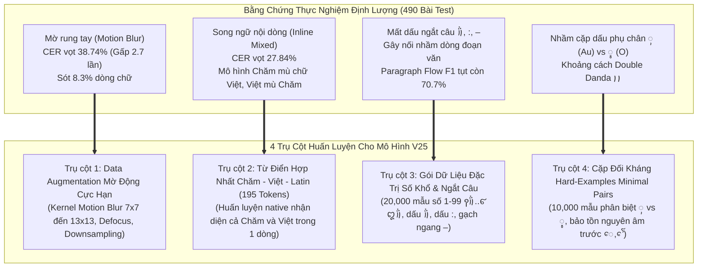

# Lộ Trình Huấn Luyện Mô Hình OCR Chăm V25 (V25 Training Roadmap & Action Plan)

Tài liệu này tổng hợp toàn bộ các kết luận thực nghiệm định lượng từ **490 bài kiểm thử phân tầng** (gồm 200 bài test dòng biến dạng, 200 trang A4 đa đoạn văn và 90 bài test nâng cao 3 hướng: Đa ngữ, Bố cục 2 cột và Ảnh thực địa di động). Đây là bản đặc tả kỹ thuật chi tiết làm cơ sở chuẩn bị dữ liệu và huấn luyện phiên bản mô hình tiếp theo (**Mô hình v25**).

---

## 1. Bốn Điểm Nghẽn Cốt Lõi Từ Thực Nghiệm Cần Giải Quyết Ở v25



---

## 2. Chi Tiết 4 Trụ Cột Huấn Luyện Cho v25

### Trụ Cột 1: Tăng Cường Khả Năng Chống Chịu Mờ Rung Tay (Anti-Motion Blur)
- **Thực trạng**: Khi người dùng chụp ảnh bằng điện thoại ở điều kiện thiếu sáng hoặc chụp vội, rung tay gây mờ vệt (motion blur) làm CER vọt từ $14.3\%$ lên **$38.74\%$**. Các dấu phụ mỏng (`ꨲ`, `ꨶ`, `ꨳ`, `ꨪ`, `ꩌ`) bị kéo vệt và dính vào phụ âm, khiến CTC Decoder đoán sai.
- **Giải pháp cho v25**:
  - Tích hợp pipeline augmentation mờ động lực học mạnh:
    - **Directional Motion Blur**: Kernel kích thước ngẫu nhiên $7\times 7, 9\times 9, 11\times 11, 13\times 13$ ở góc quay $\theta \in [0^\circ, 180^\circ]$ trên **$25\%$ tổng dữ liệu huấn luyện**.
    - **Defocus Gaussian Blur**: $\sigma \in [1.5, 3.2]$ trên $15\%$ dữ liệu.
    - **Multi-Scale Downsampling**: Thu nhỏ ảnh ngẫu nhiên $0.5\times - 0.8\times$ rồi phóng to lại (Bicubic) để mô hình học cách khôi phục đặc trưng ở độ phân giải thấp.

---

### Trụ Cột 2: Từ Điển Hợp Nhất Chăm - Việt - Latin (Unified Multilingual Vocabulary)
- **Thực trạng**: Các tài liệu Chăm hiện đại, sách nghiên cứu, từ điển và văn bản hành chính thường xuyên xuất hiện dạng **song ngữ kẹp trong cùng 1 dòng** (ví dụ: `ꨛꨯꨮ ꨆꨵꨯꨱꩃ ꨈꨣꩈ (Vua Pô Klông Gia-rai)`, `ꨚꨰꩀ ꨨꨤꨩ: đắp bờ đập dẫn nước`, số điện thoại, ngày tháng năm). Do từ điển v24 chỉ có 83 ký tự Chăm thuần, bộ Auto-Routing cấp dòng bị quá tải khiến CER tăng vọt lên **$27.84\%$**.
- **Giải pháp cho v25**:
  - **Mở rộng từ điển `cham_dict_v25.txt`** từ 83 ký tự lên **~195 ký tự**:
    1. **Bảng chữ cái Chăm đầy đủ** (Phụ âm, nguyên âm độc lập, nguyên âm phụ, dấu phụ, số đếm Chăm `꩐` - `꩙`, dấu ngắt `꩝`, `꩞`, `꩟`): 83 tokens.
    2. **Bảng chữ cái Tiếng Việt & Latin đầy đủ có dấu thanh** (`a-z`, `A-Z`, `à, á, ả, ã, ạ, ă, ắ, ằ, ẳ, ẵ, ặ, â, ấ, ầ, ẩ, ẫ, ậ, đ, è, é, ẻ, ẽ, ẹ, ê, ế, ề, ể, ễ, ệ, ì, í, ỉ, ĩ, ị, ò, ó, ỏ, õ, ọ, ô, ố, ồ, ổ, ỗ, ộ, ơ, ớ, ờ, ở, ỡ, ợ, ù, ú, ủ, ũ, ụ, ư, ứ, ừ, ử, ữ, ự, ỳ, ý, ỷ, ỹ, ỵ`): ~90 tokens.
    3. **Chữ số Latin & Ký tự đặc biệt thường dùng** (`0-9`, `(`, `)`, `[`, `]`, `:`, `-`, `–`, `/`, `.`, `,`, `?`, `!`, `"`, `'`): 22 tokens.
  - **Sinh dữ liệu tổng hợp đa ngữ nội dòng**:
    - $30,000$ mẫu chứa cấu trúc `{cham_phrase} ({viet_translation})`.
    - $15,000$ mẫu dạng từ điển giải nghĩa `{cham_word}: {viet_meaning}`.
    - $10,000$ mẫu số đếm Latin kết hợp văn bản Chăm (`꩑꩞`, `1.`, `Khổ 1:`).

---

### Trụ Cột 3: Gói Dữ Liệu Đặc Trị Số Khổ Thơ & Dấu Ngắt Biên Dòng
- **Thực trạng**: Sai lệch lớn nhất của bộ nối đoạn văn (`paragraph_flow.py`) xuất phát từ việc OCR rụng dấu ngắt câu cuối dòng `꩞` hoặc nuốt dấu hai chấm `:`, khiến câu bị nối nhầm. Đồng thời, số thứ tự khổ thơ đứng đầu dòng (như `꩔꩓꩞`..`꩕꩗꩞`) bị CTC ép thành phụ âm `ꨤ`, `ꨂ`.
- **Giải pháp cho v25**:
  - Sinh **$25,000$ mẫu số thứ tự khổ thơ** chạy liên tục từ `꩑꩞` đến `꩙꩙꩞` (1 đến 99) kèm văn bản Chăm phía sau.
  - Bổ sung padding an toàn ngẫu nhiên ở 2 biên trái/phải ($0\text{px} \to 12\text{px}$) để CTC không bị mất dấu `꩞` khi crop sát biên.
  - Huấn luyện nhận diện chính xác các dấu phân đoạn: `꩞`, `꩝꩝`, `:`, `–` (en-dash) và `-`.

---

### Trụ Cột 4: Cặp Đối Kháng Hard-Examples Cho Dấu Phụ Dễ Nhầm
- **Thực trạng**:
  - Dấu `ꨲ` (Au, U+AA32) và `ꨶ` (O, U+AA36) có cấu trúc vi mô rất tương đồng.
  - Dấu Double Danda `꩝꩝` hay bị gộp thành Single Danda `꩝`.
  - Nguyên âm trước `ꨯ` (E) và `ꨯꨱ` (Au) dễ bị nuốt khi nét vẽ thanh mảnh.
- **Giải pháp cho v25**:
  - Sinh **$15,000$ mẫu cặp từ tối thiểu (Minimal Pairs)**:
    - `{Phụ âm} + ꨲ` đối sánh trực tiếp với `{Phụ âm} + ꨶ` (ví dụ `ꨀꨲꩆ` vs `ꨀꨶꩆ`, `ꨓꨆꨴꨲꨩ` vs `ꨓꨆꨴꨶꨩ`, `ꨚꨲ` vs `ꨚꨶ`).
    - Dấu Double Danda `꩝꩝` với khoảng cách thay đổi từ 2px đến 8px kèm nhiễu mờ.
    - Tổ hợp 3 tầng dấu phụ phức tạp: `ꨣꨳꨪꩌ`, `ꨚꨵꨯꨱꩃ`.

---

## 3. Cơ Cấu Tập Dữ Liệu Huấn Luyện v25 (Quy mô: 250,000 dòng)

| Gói Dữ Liệu | Số Lượng Dòng | Mục Tiêu Kỹ Thuật | Đặc Điểm Augmentation |
| :--- | :---: | :--- | :--- |
| **Gói 1: Ngữ liệu Chăm chuẩn & Cổ tích** | 120,000 | Nền tảng từ vựng Chăm chuẩn xác (Po Klong Garai, sử thi, thơ 57 khổ) | Nền giấy cổ, texture, tiêu chuẩn |
| **Gói 2: Đặc trị Mờ Rung (Anti-Blur)** | 45,000 | Chống sụp đổ trước rung tay di động | **Motion blur 7x7-13x13**, Defocus, Downscale |
| **Gói 3: Song ngữ nội dòng (Chăm + Việt)** | 40,000 | Nhận diện mượt mà Chăm kẹp Việt/Latin | Font kết hợp NotoSansCham + NotoSans |
| **Gói 4: Số thứ tự khổ thơ & Dấu câu biên**| 25,000 | Nhận diện số 1-99, dấu `꩞`, `:`, `–` | Padding biên biến thiên 0-15px |
| **Gói 5: Cặp đối kháng Hard-Examples** | 20,000 | Khắc phục triệt để `ꨲ` vs `ꨶ`, `꩝꩝` vs `꩝` | Minimal pairs, zoom nét chân |
| **TỔNG CỘNG TẬP TRAIN v25** | **250,000** | **Toàn diện mọi điều kiện thực tế** | **Đa tầng biến dạng thực địa** |

---

## 4. Cấu Hình Huấn Luyện Kaggle GPU T4x2 Phân Tán

Tuân thủ nghiêm ngặt quy tắc tại `.agents/AGENTS.md`:

```python
import os
os.environ["KAGGLE_USERNAME"] = "gustavnguyen"
os.environ["KAGGLE_KEY"] = "6bf56db7e5c0fa7895d157167961d92b"
```

- **Bộ tăng tốc**: Kaggle GPU Nvidia Tesla T4x2 (`--accelerator NvidiaTeslaT4`).
- **Lệnh huấn luyện phân tán (Distributed Launch)**:
  ```bash
  python3 -m paddle.distributed.launch --gpus '0,1' tools/train.py -c configs/rec/rec_cham_v25.yml
  ```
- **Base Checkpoint**: Khởi tạo trọng số từ model v24 (`rec_cham_inference_v24`) để kế thừa các đặc trưng Chăm đã học tốt.
- **Kiến trúc mạng**: PP-OCRv4 Recognizer Backbone (LCNetV3 + SVTR Encoder + CTC Decoder).
- **Kích thước đầu vào (Image Shape)**: `[3, 48, 320]` (Tăng chiều cao từ 32 lên **48px** để bảo tồn tối đa các dấu phụ siêu mỏng phía trên và dưới chân chữ khi gặp ảnh mờ).
- **Batch Size**: 64 / GPU (Tổng batch size hiệu dụng: **128**).
- **Tốc độ học (Learning Rate)**: `1.5e-4` với CosineAnnealingDecay, warm-up 3 epochs.
- **Số Epochs**: 45 epochs (dừng sớm Early Stopping nếu CER tập validation không giảm sau 6 epochs).

---

## 5. Mục Tiêu Định Lượng (Target Metrics) Cho v25

1. **Chống chịu Motion Blur**: Kéo giảm CER dưới điều kiện rung tay từ **$38.74\%$ xuống dưới $18.0\%$**.
2. **Nhận diện song ngữ nội dòng**: Kéo giảm CER dòng kẹp Chăm - Việt từ **$27.84\%$ xuống dưới $12.0\%$**.
3. **Số thứ tự khổ thơ Chăm (1 - 99)**: Tỷ lệ nhận diện đúng đạt $\ge 95.0\%$.
4. **Cặp dấu `ꨲ` vs `ꨶ`**: Độ chính xác phân biệt đạt $\ge 96.0\%$.
5. **Độ chính xác nối đoạn văn A4 (Paragraph Flow F1)**: Tăng từ **$70.77\%$ lên $\ge 88.0\%$** nhờ không còn bị rụng dấu `꩞` và `:`.
