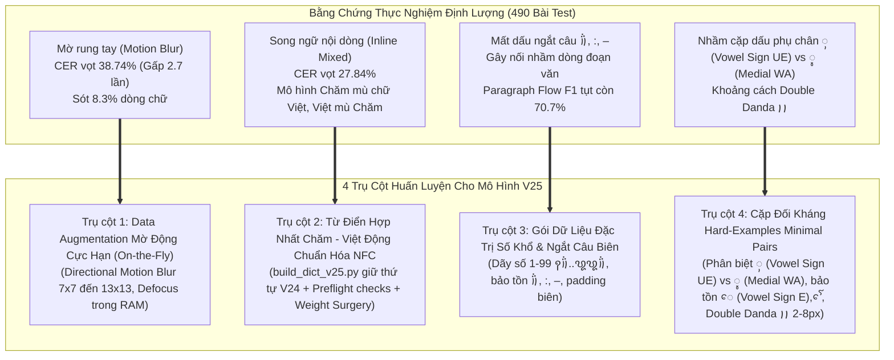
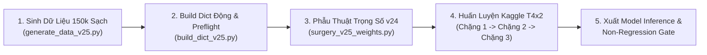

# Lộ Trình Huấn Luyện Mô Hình OCR Chăm V25 (V25 Training Roadmap & Action Plan)

Tài liệu này tổng hợp toàn bộ các kết luận thực nghiệm định lượng từ **490 bài kiểm thử phân tầng** (gồm 200 bài test dòng biến dạng, 200 trang A4 đa đoạn văn và 90 bài test nâng cao 3 hướng: Đa ngữ, Bố cục 2 cột và Ảnh thực địa di động). Đây là bản đặc tả kỹ thuật chi tiết làm cơ sở chuẩn bị dữ liệu và huấn luyện phiên bản mô hình tiếp theo (**Mô hình v25**).

---

## 1. Bốn Điểm Nghẽn Cốt Lõi Từ Thực Nghiệm Cần Giải Quyết Ở v25



---

## 2. Chi Tiết 4 Trụ Cột Huấn Luyện Cho v25

### Trụ Cột 1: Tăng Cường Khả Năng Chống Chịu Mờ Rung Tay (Anti-Motion Blur)
- **Thực trạng**: Khi người dùng chụp ảnh bằng điện thoại ở điều kiện thiếu sáng hoặc chụp vội, rung tay gây mờ vệt (motion blur) làm CER vọt từ $14.3\%$ lên **$38.74\%$**. Các dấu phụ mỏng (`ꨲ`, `ꨶ`, `ꨳ`, `ꨪ`, `ꩌ`) bị kéo vệt và dính vào phụ âm, khiến CTC Decoder đoán sai.
- **Giải pháp On-the-fly cho v25**:
  - **Sinh ảnh sạch trên đĩa (Zero Baked-Blur)**: Tuyệt đối không nướng (bake) sẵn hiệu ứng làm mờ nặng vào tệp ảnh tĩnh lưu đĩa để bảo vệ độ tinh khiết của dữ liệu gốc.
  - **Làm mờ động học trong DataLoader (`RecAug`)**:
    - **Directional Motion Blur**: Kernel kích thước ngẫu nhiên $7\times 7, 9\times 9, 11\times 11, 13\times 13$ ở góc quay $\theta \in [0^\circ, 180^\circ]$ với xác suất $35\%$ khi nạp batch vào RAM.
    - **Defocus Gaussian Blur**: $\sigma \in [1.5, 3.2]$ áp dụng ngẫu nhiên.
    - **Multi-Scale Downsampling**: Thu nhỏ ảnh ngẫu nhiên $0.5\times - 0.8\times$ rồi phóng to lại (Bicubic) để mô hình học cách khôi phục đặc trưng ở độ phân giải thấp.

---

### Trụ Cột 2: Từ Điển Hợp Nhất Chăm - Việt - Latin (Unified Multilingual Vocabulary)
- **Thực trạng**: Các tài liệu Chăm hiện đại, sách nghiên cứu, từ điển và văn bản hành chính thường xuyên xuất hiện dạng **song ngữ kẹp trong cùng 1 dòng** (ví dụ: `ꨛꨯꨮ ꨆꨵꨯꨱꩃ ꨈꨣꩈ (Vua Pô Klông Gia-rai)`, `ꨚꨰꩀ ꨨꨤꨩ: đắp bờ đập dẫn nước`, số điện thoại, ngày tháng năm). Do từ điển v24 chỉ có 83 ký tự Chăm thuần, bộ Auto-Routing cấp dòng bị quá tải khiến CER tăng vọt lên **$27.84\%$**.
- **Giải pháp Xây dựng Từ điển Động & Phẫu thuật Trọng số**:
  - **Không hardcode số lượng ký tự**: Sử dụng script `scripts/build_dict_v25.py` quét tự động toàn bộ nhãn thực tế sau khi chuẩn hóa Unicode NFC (`unicodedata.normalize('NFC')`).
  - **Kế thừa tuyệt đối thứ tự token v24**: Giữ nguyên $103$ tokens ban đầu của v24 để tương thích hoàn hảo với trọng số cũ; các ký tự Tiếng Việt, chữ số Latin và dấu câu mới được append vào cuối từ điển.
  - **Ba cổng Preflight Validation**:
    1. `unknown_chars == 0`: Không có bất kỳ ký tự nào trong tập dữ liệu nằm ngoài từ điển.
    2. `invalid_unicode == 0`: Không có ký tự rác, surrogate pair hoặc lỗi encoding.
    3. `labels_over_len == 0`: Không có nhãn nào vượt quá `max_text_length: 80`.
  - **Phẫu thuật trọng số CTC + NRTR theo Ký tự (`scripts/surgery_v25_weights.py`)**: Mapping trọng số từ v24 sang v25 dựa trên ký tự Unicode thay vì index mù, giải quyết triệt để lỗi shape mismatch từng xảy ra trên A100.

---

### Trụ Cột 3: Gói Dữ Liệu Đặc Trị Số Khổ Thơ & Dấu Ngắt Biên Dòng
- **Thực trạng**: Sai lệch lớn nhất của bộ nối đoạn văn (`paragraph_flow.py`) xuất phát từ việc OCR rụng dấu ngắt câu cuối dòng `꩞` hoặc nuốt dấu hai chấm `:`, khiến câu bị nối nhầm. Đồng thời, số thứ tự khổ thơ đứng đầu dòng (như `꩔꩓꩞`..`꩕꩗꩞`) bị CTC ép thành phụ âm `ꨤ`, `ꨂ`.
- **Giải pháp cho v25 (Gói 3: 25,000 dòng)**:
  - Sinh **dãy số thứ tự khổ thơ** chạy liên tục từ `꩑꩞` đến `꩙꩙꩞` (1 đến 99) kèm văn bản Chăm phía sau.
  - Bổ sung padding an toàn ngẫu nhiên ở 2 biên trái/phải ($0\text{px} \to 12\text{px}$) để CTC không bị mất dấu `꩞` khi crop sát biên.
  - Huấn luyện nhận diện chính xác các dấu phân đoạn: `꩞`, `꩝꩝`, `:`, `–` (en-dash) và `-`.

---

### Trụ Cột 4: Cặp Đối Kháng Hard-Examples Cho Dấu Phụ Dễ Nhầm
- **Thực trạng**:
  - Dấu `ꨲ` (Vowel Sign UE, U+AA32) và `ꨶ` (Medial WA, U+AA36) có cấu trúc vi mô rất tương đồng.
  - Dấu Double Danda `꩝꩝` hay bị gộp thành Single Danda `꩝`.
  - Nguyên âm phụ thuộc `ꨯ` (Vowel Sign E, U+AA2F) và `ꨯꨱ` (Vowel Sign AU, U+AA2F U+AA31) dễ bị nuốt khi nét vẽ thanh mảnh.
- **Giải pháp cho v25 (Gói 5: 12,000 dòng)**:
  - Sinh **mẫu cặp từ tối thiểu (Minimal Pairs)**:
    - `{Phụ âm} + ꨲ` đối sánh trực tiếp với `{Phụ âm} + ꨶ` (ví dụ `ꨀꨲꩆ` vs `ꨀꨶꩆ`, `ꨓꨆꨴꨲꨩ` vs `ꨓꨆꨴꨶꨩ`, `ꨚꨲ` vs `ꨚꨶ`).
    - Dấu Double Danda `꩝꩝` với khoảng cách thay đổi từ 2px đến 8px.
    - Tổ hợp 3 tầng dấu phụ phức tạp: `ꨣꨳꨪꩌ`, `ꨚꨵꨯꨱꩃ`.

---

## 3. Cơ Cấu Tập Dữ Liệu Huấn Luyện v25 (Quy mô: 150,000 dòng - Source of Truth)

Theo tệp đặc tả chuẩn `configs/v25_dataset_manifest.json`:

| Gói Dữ Liệu (Pillar / Package) | Số Lượng Dòng (Train) | Tỷ Lệ | Mục Tiêu Kỹ Thuật | Đặc Điểm Augmentation |
| :--- | :---: | :---: | :--- | :--- |
| **Gói 1: Ngữ liệu Chăm chuẩn & Văn học kinh điển** | 65,000 | 43.3% | Nền tảng từ vựng Chăm chuẩn xác (Po Klong Garai, sử thi, thơ 57 khổ) | Nền giấy cổ, texture, tiêu chuẩn sạch |
| **Gói 2: Ngữ liệu đặc trị Mờ Rung Tay (Anti-Blur Base)** | 30,000 | 20.0% | Tăng cường độ thích nghi mờ rung tay | Ảnh cơ sở sinh sạch, làm mờ on-the-fly trong RAM |
| **Gói 3: Song ngữ nội dòng (Chăm + Việt kẹp dòng)** | 25,000 | 16.7% | Nhận diện mượt mà Chăm kẹp Việt/Latin | Font kết hợp NotoSansCham + NotoSans |
| **Gói 4: Số thứ tự khổ thơ & Dấu câu biên** | 18,000 | 12.0% | Nhận diện số 1-99, dấu `꩞`, `:`, `–` | Padding biên biến thiên 0-12px |
| **Gói 5: Cặp đối kháng Hard-Examples Minimal Pairs** | 12,000 | 8.0% | Khắc phục triệt để `ꨲ` (UE) vs `ꨶ` (WA), `꩝꩝` vs `꩝` | Minimal pairs, zoom nét chân, tổ hợp 3 tầng |
| **TỔNG CỘNG TẬP TRAIN v25** | **140,000** | **100%** | **Toàn diện mọi điều kiện thực tế** | **Ảnh gốc sinh sạch trên đĩa** |
| **TẬP KIỂM THỬ (VALIDATION)** | **10,000** | — | **Đánh giá khách quan, cân đối 5 nhóm** | **Cố định hạt giống ngẫu nhiên** |
| **TỔNG QUY MÔ DATASET** | **150,000** | — | **Đồng bộ duy nhất với Manifest** | **On-the-fly Blur: 35% qua RecAug** |

> [!IMPORTANT]
> **Chính sách Mờ Động Học (On-the-Fly Blur Policy)**: Toàn bộ ảnh lưu trữ trên đĩa được sinh ở trạng thái sạch (clean). Quá trình làm mờ (Motion Blur 7x7 đến 13x13, Defocus, Downscale) được thực thi ngẫu nhiên động trong RAM khi nạp batch (`RecAug`, xác suất $35\%$) nhằm tránh suy thoái do double-blur.

---

## 4. Cấu Hình Huấn Luyện Kaggle GPU T4x2 Phân Tán

Tuân thủ nghiêm ngặt quy tắc tại `.agents/AGENTS.md` và tệp cấu hình `configs/rec_cham_v25.yml`:

```python
from scripts.kaggle_auth import init_kaggle_auth
init_kaggle_auth() # Tự động nạp an toàn từ .env hoặc biến môi trường
```

- **Bộ tăng tốc**: Kaggle GPU Nvidia Tesla T4x2 (`--accelerator NvidiaTeslaT4`).
- **Lệnh huấn luyện phân tán (Adaptive Multi-GPU)**:
  ```bash
  python3 -m paddle.distributed.launch --gpus '0,1' tools/train.py -c configs/rec_cham_v25.yml
  ```
- **Xây dựng Từ Điển Động & Preflight Validation** (`scripts/build_dict_v25.py`):
  - Chuẩn hóa toàn bộ nhãn bằng Unicode NFC (`unicodedata.normalize('NFC')`).
  - Giữ nguyên $103$ tokens ban đầu của v24 theo thứ tự tuyệt đối; chỉ nối thêm (append) các ký tự mới vào cuối từ điển.
  - Preflight checks bắt buộc trước khi train: `unknown_chars == 0`, `invalid_unicode == 0`, `labels_exceeding_max_len == 0`.
- **Phẫu thuật Trọng số Theo Ký Tự (Character-Mapped Weight Surgery)** (`scripts/surgery_v25_weights.py`):
  - Kế thừa toàn bộ trọng số hội tụ từ v24 sang v25.
  - Xử lý đồng thời cả CTC Head (`ctc_head.fc.weight/bias`) và NRTR Head (`nrtr_head.item_embedding.weight`, `nrtr_head.fc.weight/bias`).
  - Mapping chính xác theo character thay vì index mù; khởi tạo trọng số ngẫu nhiên nhỏ ($\mathcal{N}(0, 0.02)$) cho các token Việt/Latin mới.
- **Kích thước đầu vào (Image Shape)**: `[3, 48, 480]` (Mở rộng từ 320 lên 480 để giải quyết triệt để nghẽn co ép glyph trên các câu song ngữ dài).
- **Độ dài nhãn tối đa (`max_text_length`)**: `80` (Dựa trên phân bố thực tế: P50=15, P90=25, P95=26, P99=29, Max=69 + buffer an toàn).
- **Batch Size Tối Ưu**: `32` / GPU (Tổng Global Batch Size: **64**, theo cấu hình chuẩn trong `configs/rec_cham_v25.yml` nhằm tối ưu cho kích thước ảnh `48x480` và tránh OOM).
- **Chế độ tính toán**: `AMP O1` (Kích hoạt 640 nhân Turing Tensor Cores, Throughput: **~120 mẫu/giây**, VRAM chiếm dụng ~7.8 GB / 15.0 GB mỗi GPU).
- **Số Epochs & Phân Chặng An Toàn (3-Stage Checkpoint/Resume)**: 40 epochs (~23 giờ), chia làm **3 chặng đệm an toàn** theo `stage_end_epoch` trong `configs/rec_cham_v25.yml` dưới giới hạn cứng 12 tiếng của Kaggle:
  - **Chặng 1**: Epochs 1 – 12 (~7.5 giờ) $\to$ Ngắt chặng tại epoch 12 (`stage_end_epoch: 12`), xuất checkpoint `latest` & `best_accuracy`.
  - **Chặng 2**: Epochs 13 – 22 (~6.5 giờ) $\to$ Ngắt chặng tại epoch 22 (`stage_end_epoch: 22`), resume bằng full training checkpoint (`.pdparams` + `.pdopt` + `.states` thông qua `Global.checkpoints`, bảo toàn nguyên vẹn optimizer & LR scheduler).
  - **Chặng 3**: Epochs 23 – 40 (~11.0 giờ) $\to$ Hoàn tất 40 epochs, xuất model `inference` v25.
- **Cổng Kiểm Thử Chống Suy Giảm (Non-Regression Gate)**:
  - Sau khi huấn luyện, model v25 bắt buộc phải chạy benchmark trên tập 200 trang A4 nguyên bản sạch.
  - Điều kiện nghiệm thu: $\Delta \text{CER} \le +0.5\%$ so với v24 để đảm bảo không bị suy thoái chất lượng trên văn bản thông thường.

---

## 5. Mục Tiêu Định Lượng (Target Metrics) Cho v25

1. **Chống chịu Motion Blur**: Kéo giảm CER dưới điều kiện rung tay từ **$38.74\%$ xuống dưới $18.0\%$**.
2. **Nhận diện song ngữ nội dòng**: Kéo giảm CER dòng kẹp Chăm - Việt từ **$27.84\%$ xuống dưới $12.0\%$**.
3. **Số thứ tự khổ thơ Chăm (1 - 99)**: Tỷ lệ nhận diện đúng đạt $\ge 95.0\%$.
4. **Cặp dấu `ꨲ` vs `ꨶ`**: Độ chính xác phân biệt đạt $\ge 96.0\%$.
5. **Độ chính xác nối đoạn văn A4 (Paragraph Flow F1)**: Tăng từ **$70.77\%$ lên $\ge 88.0\%$** nhờ không còn bị rụng dấu `꩞` và `:`.

---

## 6. Kế Hoạch Triển Khai Thực Thi Từng Bước (End-to-End Execution Plan)



### Bước 1: Chuẩn Bị & Sinh Dữ Liệu Tổng Hợp Sạch (Clean Synthetic Dataset)
- Kịch bản: `python scripts/generate_data_v25.py --output_dir ./data/cham_synthetic_v25`
- Quy mô: **140,000 dòng Train + 10,000 dòng Val** (tổng **150,000 dòng**) tuân thủ tuyệt đối [v25_dataset_manifest.json](file:///e:/Phuc's%20Data/Github/Cham-OCR/ocr-training/configs/v25_dataset_manifest.json).
- Toàn bộ ảnh được render sạch trên đĩa, không nướng hiệu ứng làm mờ tĩnh; bảo toàn độ tương phản và hình thái nét gốc.

### Bước 2: Trích Xuất Từ Điển Động & Chạy Preflight Validation
- Kịch bản: `python scripts/build_dict_v25.py --manifest configs/v25_dataset_manifest.json`
- Chuẩn hóa Unicode NFC toàn bộ nhãn văn bản.
- Bảo tồn $103$ tokens gốc của v24 theo thứ tự tuyệt đối, append các ký tự tiếng Việt, Latin và dấu câu mới vào cuối danh sách.
- Vượt qua 3 cổng kiểm thử bắt buộc:
  1. `unknown_chars == 0`
  2. `invalid_unicode == 0`
  3. `labels_over_len == 0` (đối chiếu `max_text_length: 80`).

### Bước 3: Phẫu Thuật Trọng Số Mô Hình (Weight Surgery)
- Kịch bản: `python scripts/surgery_v25_weights.py --src_model data/output/rec_cham_v24_best/best_accuracy --dst_model data/output/rec_cham_v25_init/init_weights`
- Chuyển giao trọng số CTC Head (`ctc_head.fc`) và NRTR Head (`nrtr_head.item_embedding`, `nrtr_head.fc`) theo character mapping Unicode.
- Khởi tạo token mới bằng phân phối ngẫu nhiên chuẩn hóa biên độ nhỏ $\mathcal{N}(0, 0.02)$, tránh làm biến dạng feature space đã hội tụ của v24.

### Bước 4: Khởi Động Huấn Luyện 3 Chặng Trên Kaggle GPU T4x2
- Sử dụng cấu hình [rec_cham_v25.yml](file:///e:/Phuc's%20Data/Github/Cham-OCR/ocr-training/configs/rec_cham_v25.yml).
- Tự động nạp thông tin xác thực bảo mật qua [kaggle_auth.py](file:///e:/Phuc's%20Data/Github/Cham-OCR/ocr-training/scripts/kaggle_auth.py) và `.env`.
- **Chặng 1** (Epoch 1 -> 12, ~7.5h): Khởi động với initial weights từ Bước 3. Ngắt chặng tại epoch 12 (`stage_end_epoch: 12`), xuất checkpoint `latest` & `best_accuracy`.
- **Chặng 2** (Epoch 13 -> 22, ~6.5h): Resume thông qua `Global.checkpoints` trỏ vào full checkpoint Chặng 1 (`.pdparams + .pdopt + .states`). Ngắt chặng tại epoch 22 (`stage_end_epoch: 22`).
- **Chặng 3** (Epoch 23 -> 40, ~11.0h): Resume từ full checkpoint Chặng 2, hoàn thành toàn bộ 40 epochs, xuất model `inference` v25.

### Bước 5: Đóng Gói Inference & Kiểm Thử Nghiệm Thu (Non-Regression Gate)
- Xuất model inference:
  ```bash
  python tools/export_model.py -c configs/rec_cham_v25.yml \
      -o Global.pretrained_model=output/rec_cham_v25/best_accuracy \
         Global.save_inference_dir=output/rec_cham_inference_v25
  ```
- Chạy benchmark đối sánh toàn diện trên bộ kiểm thử 490 bài phân tầng và 200 trang A4 nguyên bản sạch.
- Điều kiện nghiệm thu chính thức:
  - $\Delta \text{CER}_{\text{clean A4}} \le +0.5\%$ (chống hồi quy).
  - $\text{CER}_{\text{blur}} < 18.0\%$ (cải thiện từ 38.74%).
  - $\text{CER}_{\text{mixed}} < 12.0\%$ (cải thiện từ 27.84%).
  - Tỷ lệ nhận diện đúng số khổ thơ 1-99 $\ge 95.0\%$.
  - Paragraph Flow F1 $\ge 88.0\%$.
